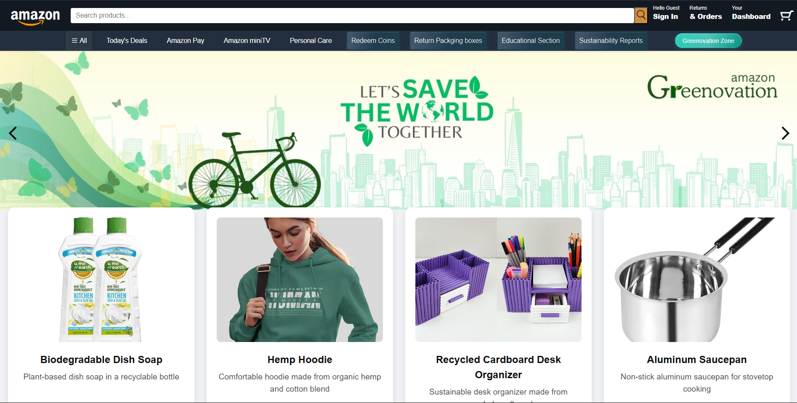
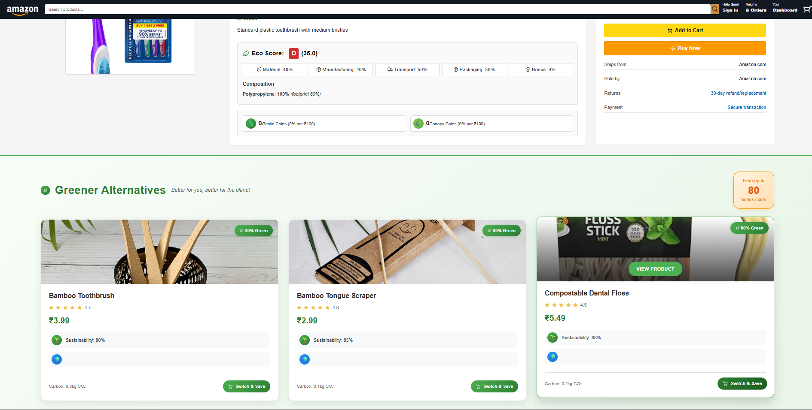
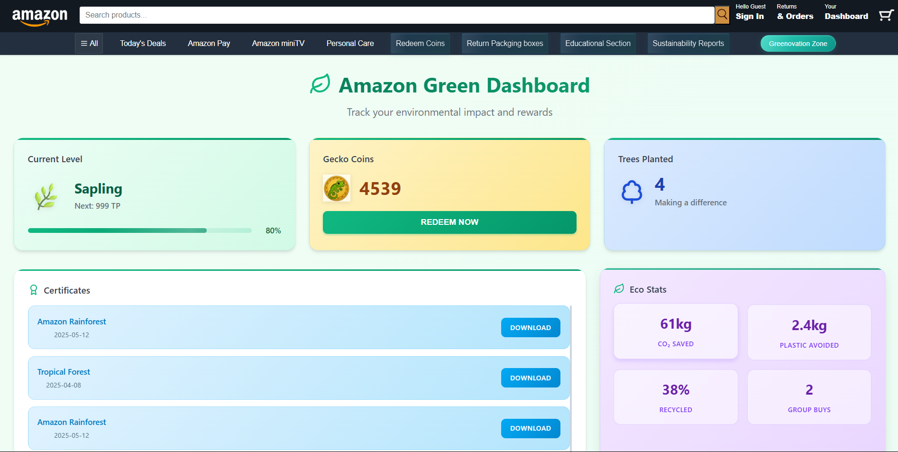
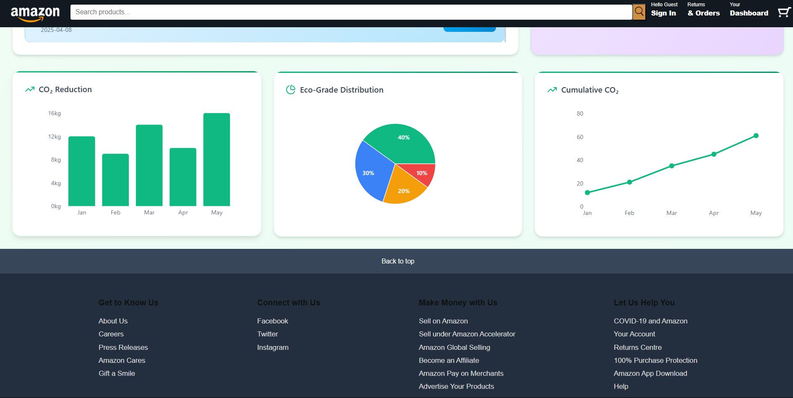
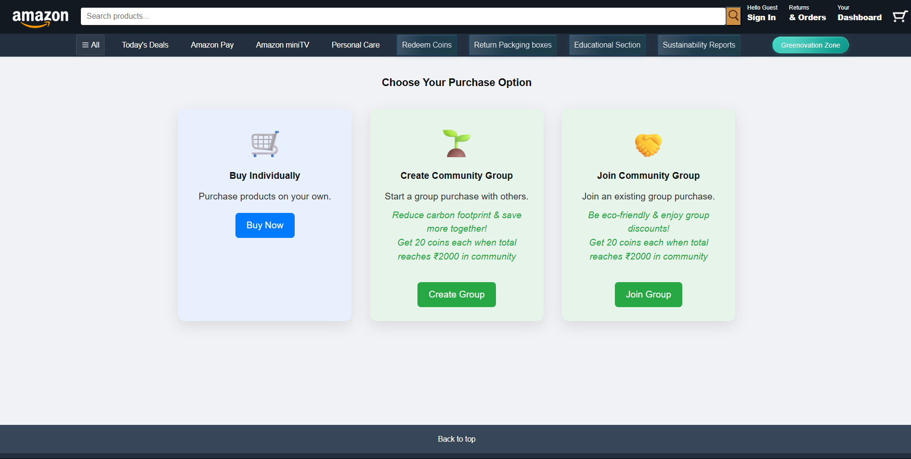
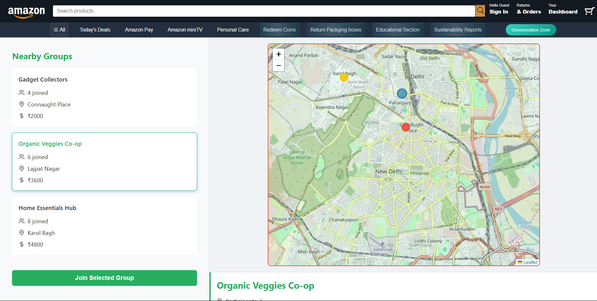
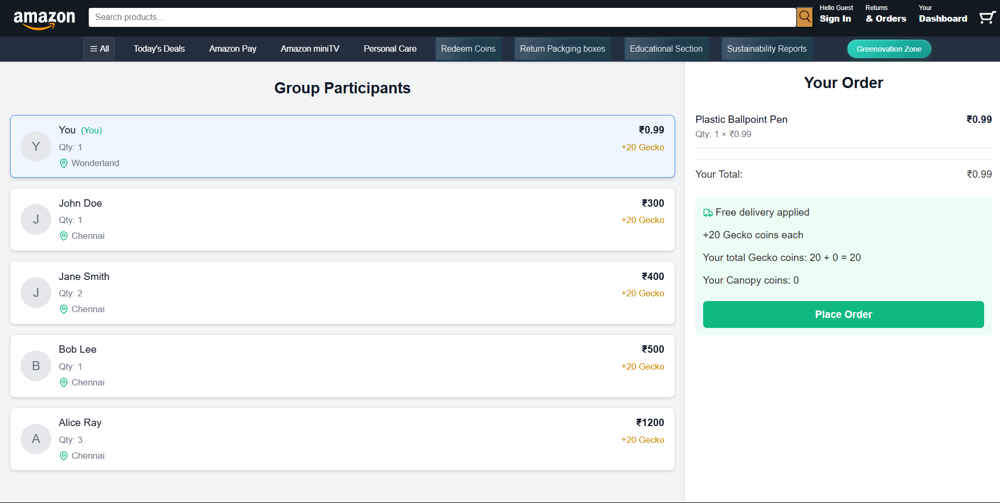
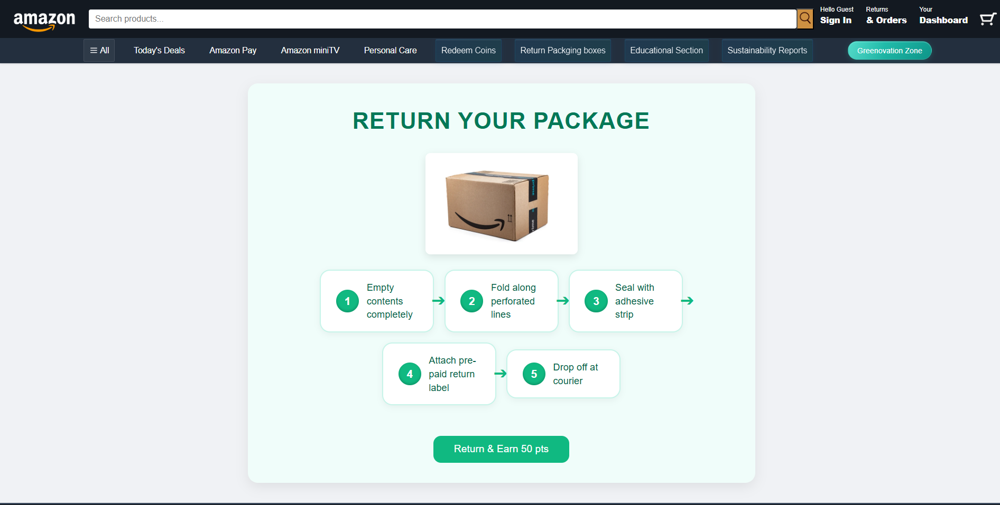
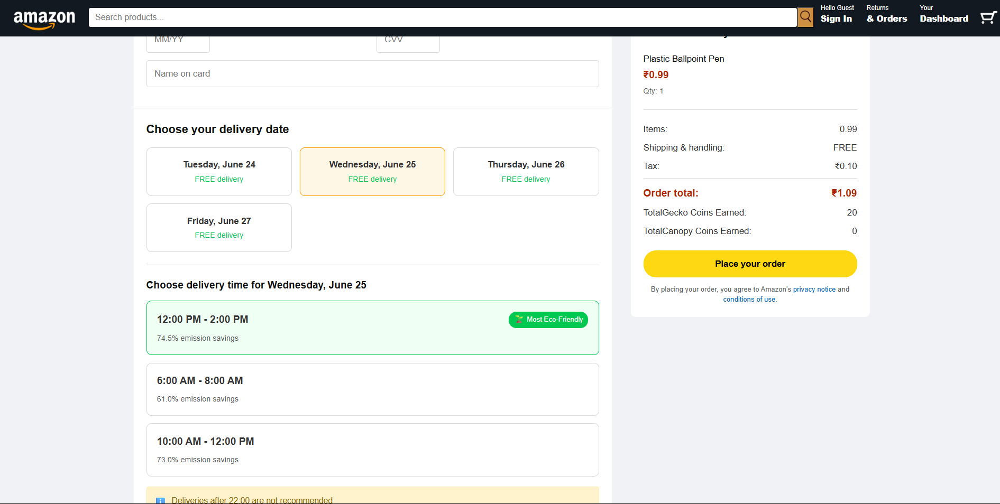

# 🛍️ Amazon HackOn Prototype - Team OG

## 🔗 **[Live Demo](#)** https://hack-on-prototype-t8vt.vercel.app/

## 🌱 Project Description

Amazon OG is a prototype redefining **sustainable e-commerce**. Our mission?  
Make green choices irresistible. This platform enables AI-powered discovery of eco-products, offers gamified rewards through **Gecko Coins (Go Echo)**, and optimizes every step of your order—from cart to cardboard recycling.

Using AI, smart logistics, and intuitive dashboards, we’re turning “eco-conscious” into “effortless.”

---

## 🚀 Features

### 1. 🌿 Amazon Greenovation Zone

A curated **Green Store** for verified eco-friendly products, complete with sustainability grades and filters.

---

### 2. 🧠 AI Powered Green Alternative

Real-time green recommendations using product life-cycle data and AWS SageMaker. Say goodbye to plastic toothbrushes.

---

### 3. 🪙 Incentives and Redeem Shop

Dual-coin system:

- **Gecko Coin (Go-Echo)** = Instant rewards
- **Canopy Coin** = Real trees planted

---

### 4. 📊 Custom Dashboard

See your eco-impact: CO₂ saved, trees planted, and green points earned. Track progress, earn perks, feel good.

---

### 5. 👥 Community Shopping

Save on emissions. Earn rewards. Shop together.

### 6. 📦 Package Retrieval

Return excess packaging and get **Gecko Coins**.  
Delivery agents also collect recyclables during drop-offs in small towns.

## 

### 8. 📍 AI Powered Delivery Scheduler

Smarter delivery slots that reduce missed attempts using traffic, weather & preferences.  
Less fuel. More precision.

## 

## 🧰 Tech Stack

| Layer              | Technology                           |
| ------------------ | ------------------------------------ |
| 💻 Frontend        | React + Tailwind CSS                 |
| 🔄 Backend API     | Node.js (Express)                    |
| 🧠 AI / ML Model   | Python + all-MiniLM-L6-v2            |
| 📦 Database        | MongoDB Atlas                        |
| 🚀 Deployment      | Vercel (Frontend) + Render (Backend) |
| 🧩 Version Control | GitHub                               |

---

### 👨‍💻 Team OG

- Ayush Mittal
- Nitin Singh
- Srijan Pandit

🏫 Vellore Institute of Technology

---

> "Green is not a trend—it’s the new default."  
> Let’s build a future where **shopping responsibly is effortless**.
